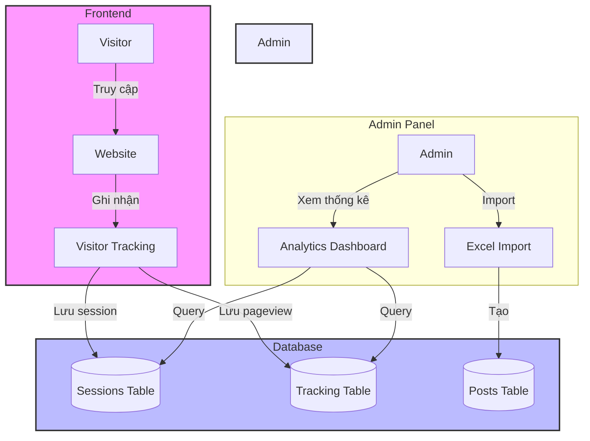
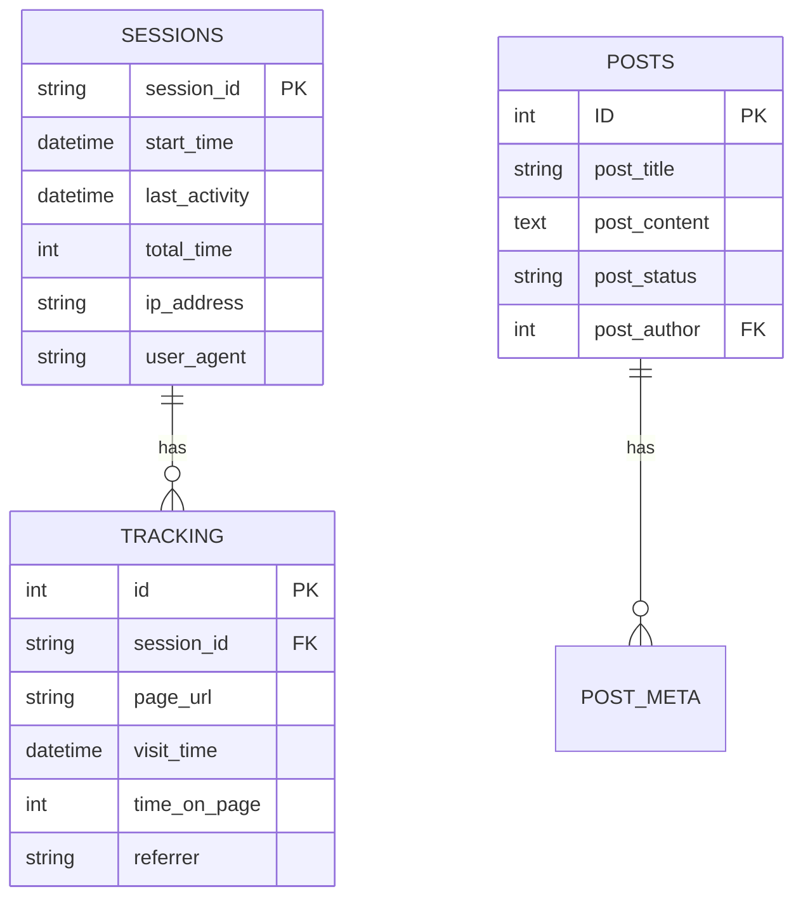
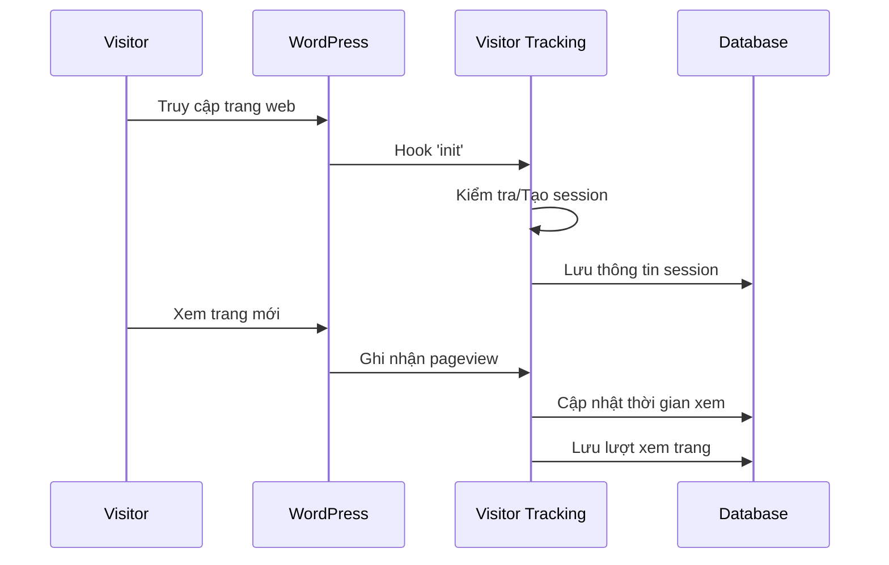
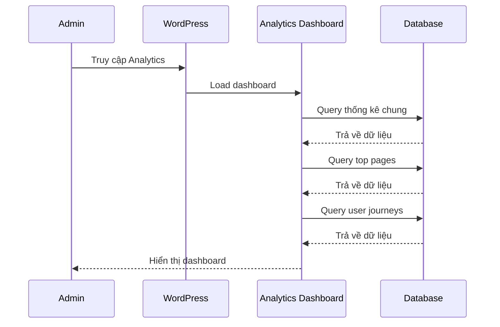
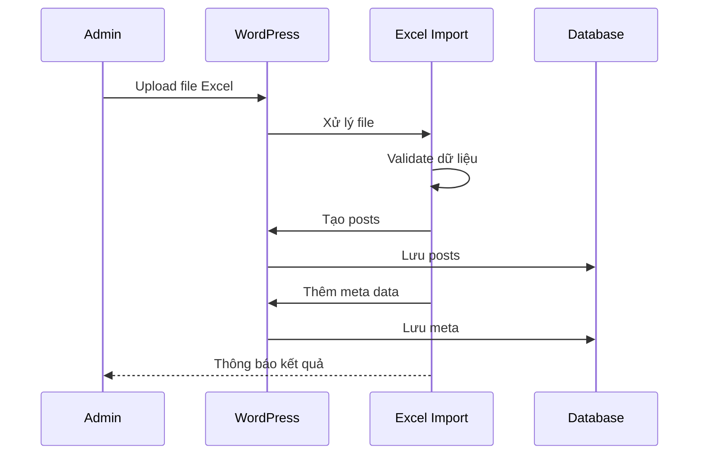

# WordPress Analytics & Excel Import

Gói mở rộng cho WordPress bao gồm hai tính năng chính:
1. Theo dõi và phân tích lượt truy cập (cả nội bộ và Google Analytics)
2. Import dữ liệu từ file Excel

## Yêu cầu hệ thống

- WordPress 5.0 trở lên
- PHP 7.4 trở lên
- MySQL 5.6 trở lên
- Extension PHP: php-spreadsheet
- Composer
- Tài khoản Google Analytics (tùy chọn)

## Hướng dẫn cài đặt

### 1. Chuẩn bị

1. Tạo thư mục trong themes:
```bash
cd wp-content/themes
mkdir your-theme-name
```

2. Copy tất cả files vào thư mục vừa tạo:
```
your-theme-name/
├── assets/
├── includes/
├── functions.php
├── composer.json
└── style.css
```

3. Tạo file style.css với thông tin theme:
```css
/*
Theme Name: Your Theme Name
Description: Theme with Analytics and Excel Import
Version: 1.0
Author: Your Name
*/
```

### 2. Cài đặt dependencies

1. Cài đặt Composer (nếu chưa có):
- Windows: Tải và cài đặt từ [getcomposer.org](https://getcomposer.org/)
- Linux: `curl -sS https://getcomposer.org/installer | php`

2. Cài đặt các package:
```bash
cd wp-content/themes/your-theme-name
composer install
```

### 3. Kích hoạt theme

1. Truy cập WordPress Admin > Appearance > Themes
2. Tìm và kích hoạt theme của bạn
3. Các bảng database sẽ tự động được tạo khi kích hoạt

### 4. Kiểm tra cài đặt

1. Kiểm tra menu mới trong Admin:
   - Menu "Analytics"
   - Menu "Import Excel"

2. Kiểm tra database:
   - Bảng `wp_visitor_tracking`
   - Bảng `wp_visitor_sessions`

## Sơ đồ luồng hoạt động

### System Flow Diagram



### Database Schema



### 1. Visitor Tracking Flow



### 2. Analytics Dashboard Flow



### 3. Excel Import Flow



## Luồng thao tác người dùng

### 1. Tracking Visitor
1. Người dùng truy cập website
2. Hệ thống kiểm tra cookie session
   - Nếu chưa có: tạo session mới
   - Nếu có: sử dụng session hiện tại
3. Ghi nhận thông tin:
   - IP address
   - User agent
   - Trang đang xem
   - Thời gian xem
   - Referrer
4. Cập nhật session:
   - Tổng thời gian
   - Số trang đã xem
   - Hành trình truy cập

### 2. Xem Analytics
1. Admin đăng nhập WordPress
2. Truy cập menu Analytics
3. Xem các thống kê:
   - Tổng quan (sessions, pageviews)
   - Thống kê theo ngày
   - Top trang được xem
   - Hành trình người dùng
4. Lọc và xuất dữ liệu (nếu cần)

### 3. Import Excel
1. Admin truy cập menu Import Excel
2. Upload file Excel
3. Hệ thống xử lý:
   - Đọc dữ liệu từ file
   - Validate từng dòng
   - Import vào posts
   - Thêm categories/tags
4. Hiển thị kết quả import

## Tính năng Import Excel

### Sử dụng
1. Truy cập menu "Import Excel" trong WordPress Admin
2. Upload file Excel của bạn (hỗ trợ .xlsx, .xls)
3. Nhấn "Import" để bắt đầu quá trình import

### Cấu trúc file Excel
File Excel cần có các cột theo thứ tự:
- Cột A: Title (tiêu đề bài viết)
- Cột B: Content (nội dung bài viết)
- Cột C: Status (publish/draft)
- Cột D: Author (username)
- Cột E: Categories (phân cách bằng dấu phẩy)
- Cột F: Tags (phân cách bằng dấu phẩy)

### Sitemap
Sau khi import thành công, hệ thống sẽ tự động tạo/cập nhật sitemap:

1. Vị trí file: `your-domain.com/sitemap.xml`

2. Cấu trúc sitemap:
   - Trang chủ (priority: 1.0)
   - Bài viết đã publish (priority: 0.8)
   - Trang categories (priority: 0.6)

3. Thông tin mỗi URL:
   ```xml
   <url>
     <loc>https://your-domain.com/post-slug</loc>
     <lastmod>2025-04-08T09:07:49+00:00</lastmod>
     <priority>0.8</priority>
   </url>
   ```

4. Tự động ping Google:
   - Sau khi tạo/cập nhật sitemap
   - Gửi thông báo tới Google Search Console
   - Giúp index nội dung mới nhanh hơn

## Tính năng Tracking

### Tracking nội bộ
- Tự động theo dõi lượt truy cập
- Lưu thông tin: IP, User Agent, URL, Referrer, Thời gian
- Sử dụng cookies để tránh đếm trùng (hết hạn sau 30 ngày)
- Xem thống kê tại menu "Analytics" trong Admin

### Google Analytics
1. Đăng nhập vào [Google Analytics](https://analytics.google.com)
2. Tạo property mới và lấy Measurement ID (định dạng G-XXXXXXXXXX)
3. Thay thế G-XXXXXXXXXX trong file `functions.php` với ID của bạn:
```php
gtag('config', 'G-XXXXXXXXXX');
```

### Xem thống kê
1. **Thống kê nội bộ:**
   - Truy cập WordPress Admin > Analytics
   - Xem số lượt truy cập 7 ngày gần nhất
   - Dữ liệu được lưu trong bảng `wp_visitor_tracking`

2. **Google Analytics:**
   - Truy cập [Google Analytics Dashboard](https://analytics.google.com)
   - Xem các metrics chi tiết: số người dùng, thời gian truy cập, bounce rate...

## Lưu ý

- Backup database trước khi import Excel
- Kiểm tra định dạng dữ liệu trong Excel trước khi import
- Đảm bảo đã cấu hình đúng Google Analytics ID
- Tracking chỉ hoạt động khi theme được kích hoạt

## Lưu ý

- Backup database trước khi import
- Kiểm tra định dạng dữ liệu trong Excel trước khi import
- Giới hạn kích thước file tùy thuộc vào cấu hình server
